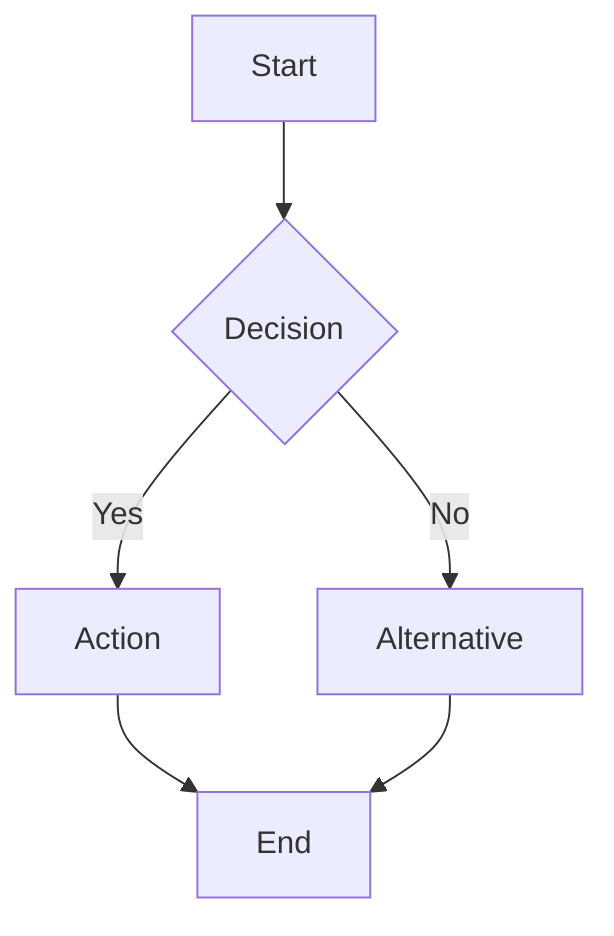
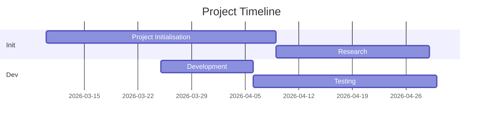

# Andika

> **Write. Document. Submit.**

---

⌕ [Live Demo](https://jesselsookha.github.io/andika)   
⌗ [Report Bug](https://github.com/jesselsookha/andika/issues)   
⌨ [Request Feature](https://github.com/jesselsookha/andika/issues)

---

## ⌘ About the Project

Andika (Swahili: *"to write"*) is an **offline-first Markdown editor** designed specifically for **students** who need to create README files, technical documentation, CHANGELOGs, and academic submission documents—likely to be pushed to a repository.

Unlike generic Markdown editors, Andika provides:

⎄ **25+ Student-Centred Templates** – Not just headings, but substantial boilerplate with placeholders that teach proper documentation structure while requiring students to actively edit and personalise their work.

⌗ **Academic Integrity Focus** – Templates for declarations, self-assessment, challenges faced, and learning reflections—directly applicable to coursework submissions.

⌇ **Offline by Default** – No account, no cloud, no tracking. Open `index.html` and it works. Save directly to your computer using the native file system API.

⚌ **Unicode Interface** – Distinctive typographic identity using Unicode symbols instead of emoji icons. Universally viewable, no external assets required.

⎌ **Export Flexibility** – Export as PDF (print-to-PDF) or standalone HTML documents with embedded GitHub-style styling.

---

## ⌕ How to Use Andika

### ⎄ Getting Started

| Action | How To | What It Does |
|--------|--------|--------------|
| **New Document** | Click `⎄ New` or `Ctrl+N` | Clears editor and resets filename to `Untitled.md` |
| **Open File** | Click `⌂ Open` or `Ctrl+O` | Opens native file picker; loads `.md` file into editor |
| **Save File** | Click `↓ Save` or `Ctrl+S` | Saves current content. New files trigger "Save As" dialog |
| **Export PDF** | Click `⌕ PDF` or `Shift+Ctrl+P` | Opens print dialog; choose "Save as PDF" |
| **Export HTML** | Click `⌗ HTML` or `Shift+Ctrl+H` | Downloads standalone styled HTML document |

---

### ⌗ Working with Templates

1. **Browse Categories** – Templates are organised into five accordion sections:

   - ⌗ Project Foundations
   - ⎌ Technical Documentation
   - ⌘ Assessment & Submission
   - ⚌ Collaboration
   - ⌂ Release & Maintenance

2. **Search** – Use the `⌕ Find template...` search bar to filter templates by keyword.

3. **Insert** – Click any template item to insert it at your **current cursor position**.

4. **Customise** – Each template includes `[placeholders]` and descriptive comments. **Students must edit these**—this is by design. Documentation is not copy-paste; it is communication.

> ⎁ *Pro tip: Templates are designed to teach. If a student can use it without thinking, we haven't done our job. The thinking is the point.*

---

### ⎁ Writing & Editing

**Editor Features:**

- Line numbers for easy reference
- Markdown syntax highlighting
- Word and character count (real-time)
- Auto-save to browser localStorage (restore prompt on reload)

**Keyboard Shortcuts:**

| Shortcut | Function |
|----------|----------|
| `Ctrl+B` | Bold (`**text**`) |
| `Ctrl+I` | Italic (`*text*`) |
| `Ctrl+K` | Insert link |
| `Ctrl+[` | Decrease heading level |
| `Ctrl+]` | Increase heading level |
| `Ctrl+L` | Insert bullet list |
| `Ctrl+Alt+C` | Insert code block |
| `Ctrl+Alt+T` | Open Table Generator Wizard |
| `Shift+Ctrl+P` | Export as PDF |
| `Shift+Ctrl+H` | Export as HTML |

**Dark Mode:**

- Click `☀︎` / `☾` in the header to toggle
- Remembers your preference
- Respects system preference on first visit

---

### ⌕ Preview & Diagrams

The right panel renders your Markdown in **GitHub Flavoured Markdown** style, including:

- Headers, lists, tables, blockquotes
- Syntax-highlighted code blocks
- **Mermaid.js diagrams** – Use ` ```mermaid ` code blocks to create flowcharts, sequence diagrams, Gantt charts and more.

**Example Mermaid Diagram:**



**Example Gantt Chart:**



---

### ⎔ Table Generator Wizard

Creating tables in Markdown is tedious. Andika includes a **visual table generator**:

1. Click `⎔ Table Generator` in the cheatsheet Tools section (or press `Ctrl+Alt+T`)
2. Set number of columns (1–10) and rows (1–20)
3. Choose alignment (left, centre, right)
4. Click "Insert Table"

A properly formatted Markdown table is inserted at your cursor position.

---

### ⌂ Working Offline

Andika is designed to work **without an internet connection**:

✅ All libraries (CodeMirror, Marked, Mermaid) load via CDN but are cached.  
✅ File operations use browser-native APIs—no server required.  
✅ No telemetry, no analytics, no user accounts.  
✅ Entire application is static HTML/CSS/JavaScript.

**To distribute and use without internet access:**

1. Download the three library files:  
   `codemirror.min.js`, `marked.min.js`, `mermaid.min.js`
2. Place them in a `libs/` folder.
3. Update the `<script>` tags in `index.html` to point to local paths.

---

## ⌇ Built With

- [CodeMirror](https://codemirror.net/) – Versatile text editor implemented in JavaScript
- [Marked](https://marked.js.org/) – Full-featured Markdown parser and compiler
- [Mermaid](https://mermaid.js.org/) – Diagramming and charting tool
- [Inter](https://rsms.me/inter/) – Carefully crafted typeface for UI text
- [Andika](https://fonts.google.com/specimen/Andika) – Sans serif font with character
- [Fira Mono](https://fonts.google.com/specimen/Fira+Mono) – Monospace font for code

---

## ⚌ Inspiration & Acknowledgements

Andika does not exist in a vacuum. It was inspired by—and humbly stands alongside—several remarkable projects:

| Project | Author | Influence |
|---------|--------|-----------|
| **[StackEdit](https://stackedit.io/)** | Benoît Schweblin | Split-pane Markdown editing paradigm |
| **[Dillinger](https://dillinger.io/)** | Joe McCann, Martin Broder | Browser-based Markdown simplicity |
| **[readme.so](https://readme.so/)** | [Katherine Oelsner](https://github.com/octokatherine) | Template-driven README construction ([repository](https://github.com/octokatherine/readme.so)) |

Katherine's work on readme.so demonstrated that **templates are not just shortcuts—they are teaching tools**. Andika extends this concept specifically for academic contexts, adding assessment-focused templates, academic integrity declarations, and self-reflection frameworks.

> *"If I have seen further, it is by standing on the shoulders of giants."*  
> — Isaac Newton, 1675

---

## ⎁ Author

**Andika** was created by and for educators who believe that documentation is a core competency, not an afterthought.

**Author:** Jessel Sookha  
**Contact:** [jsookha@emeris.ac.za](mailto:jsookha@emeris.ac.za)  
**Live Demo:** [https://jesselsookha.github.io/andika](https://jesselsookha.github.io/andika)

*This project began as a response to students who needed to understand the importance of documenting their work for homework, assignments, and assessments. Copying and pasting templates without understanding their context is unacceptable. Every project pushed to a repository requires both common and unique additions—customised specifically to the work being produced.*

---

## ⌕ License

Distributed under the MIT License. See the `LICENSE` file for more information.

---

## ⌗ Contributing

Contributions are **welcome and appreciated**—this is a student-centred tool, and student feedback is the most valuable contribution of all.

**Ways to contribute:**

- X Report bugs
- ⊕ Suggest features
- ¶ Improve documentation
- ⋈ Translate the interface
- ⧉ Test on different devices

Please read the existing template patterns before adding new ones—consistency helps students learn faster.

---

## ⌖ Roadmap

**Under consideration:**

- ⌇ Additional template languages (Spanish, French, Kiswahili, Lingala, isiXhosa)
- ⎁ Drag-and-drop image upload (converting to Base64 or relative paths)
- ⌕ Document statistics (reading time, readability level)
- ⌗ Custom template saving (user-created templates)
- ⌨ VS Code extension version

---

## ⎁ Final Note to Students

Andika was built for you.

Not because you can't use other tools—you absolutely can. StackEdit is excellent. Dillinger is elegant. readme.so is brilliant.

Andika exists because **you should never be blocked from documenting your work**. No internet? No problem. No account? No problem. No idea how to structure a README? That's what the templates are for.

The templates give you a starting point. But the words, the code, the ideas—those have to come from you.

**Write. Document. Submit.**

Then do it again, better than before.

That's how we learn.

---

**Andika** — ⎁ write, ⌕ document, ⌂ submit

Free for students. Forever offline. Forever open source.

---

